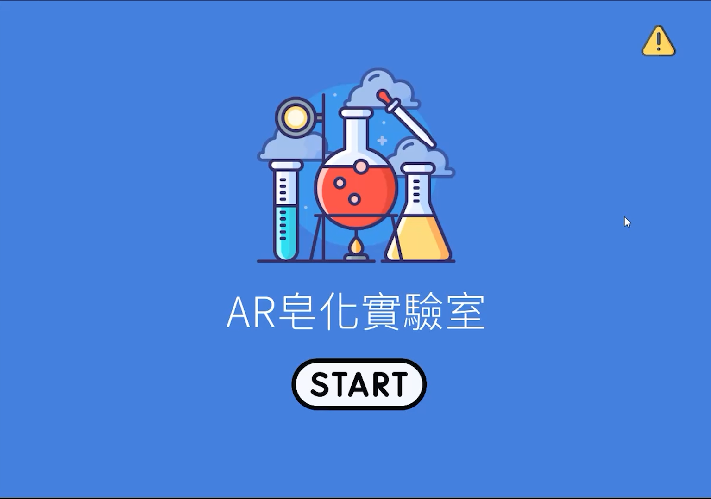

<h1 style="font-size: 28px;">ScienceAR - AR皂化實驗室</h1>

  ScienceAR 是一款以 Unity 與 Vuforia 製作的 AR（擴增實境）化學教育互動系統，
  結合圖卡偵測、互動操作、即時提示與學習回饋，協助學生模擬皂化反應實驗流程，
  並強化知識理解與應用。

<h2 style="font-size: 20px;">系統畫面展示</h2>

點擊圖片觀看操作影片

<h2>專案用途</h2>

  本專案為研究所碩論開發之教育輔助系統，展示以下能力：

<ul>
  <li>Unity 結合 Vuforia 實作圖卡辨識與 AR 互動</li>
  <li>支援多階段學習流程（操作、測驗、重試、解說）</li>
  <li>提示系統根據學生行為提供即時協助</li>
  <li>記錄學習行為並匯出成 .txt，供後續分析</li>
  <li>整合問卷跳轉與後測填答</li>
</ul>

<h2>操作方式</h2>
<ol>
  <li>透過 Vuforia 圖卡操作進行擬似化學實驗（拖曳、加熱、攪拌等）</li>
  <li>系統偵測錯誤或停滯狀況，自動提供提示與回饋</li>
  <li>選擇題測驗，系統記錄錯題並引導重做</li>
  <li>所有題目完成後顯示解說，需重新作答錯題以加強理解</li>
  <li>操作過程全程紀錄，並可於流程結束導向 Google 表單問卷</li>
</ol>

<h2>開發工具</h2>
<ul>
  <li>Unity 2019.x</li>
  <li>Vuforia Engine</li>
  <li>C# / Unity API</li>
  <li>Lean Touch Plugin</li>
</ul>

<h2>專案結構說明</h2>
<ul>
  <li>
    <strong>提示系統：</strong> 
    根據學生操作狀況提供普通 / 詳細 / 高階提示 
    對應腳本：<code>Hint_Manager.cs</code>, <code>Hint_Level.cs</code>
  </li>
  <li>
    <strong>互動動畫控制：</strong> 
    控制燒杯加熱、液體變色等動畫流程 
    對應腳本：<code>Beaker_Anim.cs</code>
  </li>
  <li>
    <strong>行為紀錄模組：</strong> 
    即時記錄錯誤類型、互動時間與停滯狀況，輸出為文字檔案 
    對應腳本：<code>BehaviorLogger.cs</code>
  </li>
  <li>
    <strong>測驗與回饋引導：</strong> 
    題目作答記錄、錯題導向回原步驟重做、錯題再測驗 
    對應腳本：<code>QuestionsM2.cs</code>, <code>PersistenceManager.cs</code>
  </li>
  <li>
    <strong>問卷跳轉功能：</strong> 
    完成流程後導引至 Google 表單收集回饋或後測 
    對應腳本：<code>Buttons_Control.cs</code>
  </li>
</ul>

<h2>設計目標</h2>

  本系統旨在提升學生對化學實驗步驟與知識的理解，結合圖卡互動、
  即時回饋與適性輔助，建立完整的 AR 教學輔助架構，適用於自學平台、
  翻轉教室或實驗教學前置預習。

